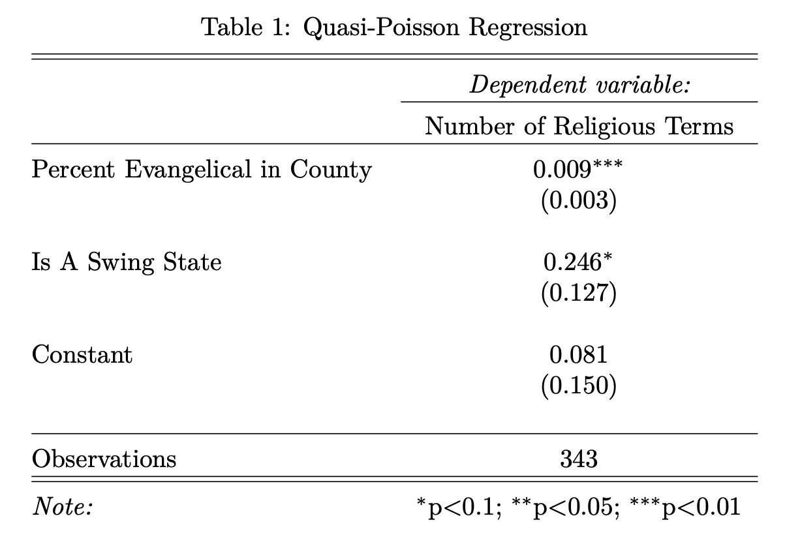

# Religion and Elections: Trump’s Religious Rhetoric Use in his 2016 Presidential Campaign

Introduction
------
When thinking of leaders who represent Christian values, Donald Trump is probably not the first person that comes to mind. Nevertheless, he secured a large majority of evangelical Christian votes in both 2016 and 2020 (Gorski 2017, 338; Margolis 2020, 89; Scala 2020, 917; Whitehead, Perry, and Baker 2018, 147). Previous literature tries to explain this contradictory relationship with white Christian nationalism (Gorski 2017, 342; Whitehead, Perry, and Baker 2018, 150), Trump’s appeal to nominal evangelicals (Scala 2020, 938), and the slow trend of all evangelicals towards the GOP (Margolis 2020, 111). However, there has also been research into the frequency of religious rhetoric used by past presidents, and Trump’s religious rhetoric use per thousand words was about twice as frequent as every president since FDR (Hughes 2019, 534). So, was an increased use of religious rhetoric one of Trump’s tactics in 2016? My research question explores if strategic use of religious rhetoric helped Trump win more evangelical voters and swing states in the 2016 election compared to Mitt Romney in 2012. This question is important because it studies a recent election that broke many political norms. And if Donald Trump aims for another presidential run in 2024, he might use similar tactics from his 2016 bid.

<!-- -->

Repo Guide
------
+ /graphics : folder containing images for the paper
+ /raw-data : raw data used in the analysis
+ data-analysis.Rmd : Rmd with all my code for the analysis
+ data-analysis.html : html output of my figures and tables
+ data-analysis.pdf : pdf output of my figures and tables
+ paper.Pdf : Pdf of my paper
